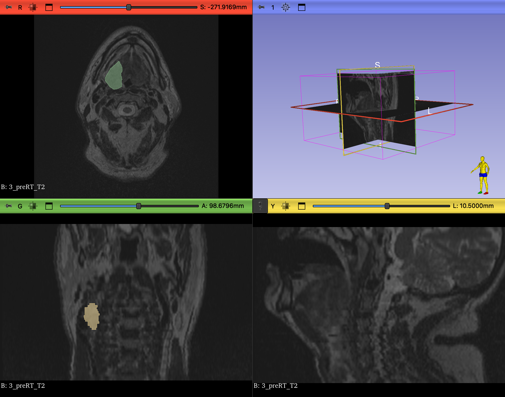
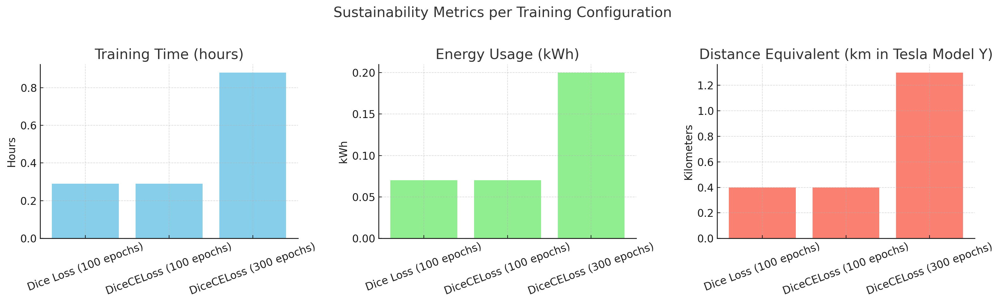
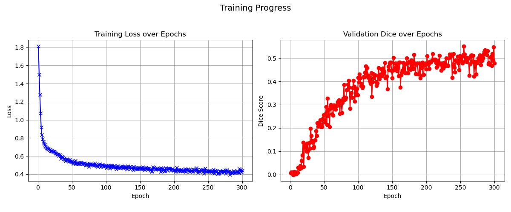

# HNTS-MRG Tumor Segmentation — TDT4265 Mini-Project

This repository contains my submission for the **TDT4265 Mini-Project** in *Computer Vision and Deep Learning* (Spring 2025, NTNU).  
I chose the **Medical Image Segmentation** task and worked on the **preRT subtask** of the **HNTS-MRG Challenge**.

The goal was to implement a basic but functional segmentation pipeline for tumor
regions in 3D MRI scans using deep learning.

## Project Summary

The HNTS-MRG challenge focuses on automating tumor segmentation in MRI data for head and neck cancer patients undergoing radiotherapy. Manual annotation is time-consuming and prone to inconsistency, so the aim is to support MR-guided adaptive radiotherapy with a deep learning-based solution.

This project uses the **MONAI** framework, which is built on PyTorch and optimized for medical imaging tasks.

## Model Architecture

The model used is a standard **3D UNet**, configured as follows:

- **Input:** Single-channel (T2-weighted MRI)
- **Output:** 3 classes (Background, GTVp, GTVn)
- **Encoder Channels:** (16, 32, 64, 128, 256)
- **Strides:** (2, 2, 2, 2)
- **Residual Units:** 2
- **Loss Function:** Combined Dice + Cross-Entropy Loss (`DiceCELoss`)
- **Evaluation Metric:** Mean Dice Score (excluding background)

The model is implemented using `monai.networks.nets.UNet`.

## Data Preparation & Augmentation

All preprocessing and augmentations were performed using `monai.transforms`.

### Common Preprocessing
- Load NIfTI images and labels
- Convert to RAS orientation
- Resample to isotropic voxel spacing (1mm³)
- Foreground cropping
- Intensity scaling
- Spatial padding to (96×96×96)

### Training Augmentations
- Random cropping by label presence (positive/negative sampling)
- Random flips (along x, y, z)
- Random 90° rotations

### Validation
- Only basic preprocessing + conversion to tensor

## Training Setup

The model was trained with the following settings:

- **Epochs:** 300
- **Batch size:** 1
- **Optimizer:** Adam
- **Learning rate:** 1e-4
- **Validation strategy:** Sliding window inference with softmax + argmax

Training progress was tracked with loss values and Dice scores, both saved and visualized.

## Sustainability

As part of the course requirement, I estimated the energy usage of the training process.  
Training was performed on an **NVIDIA GeForce RTX 4090** GPU, with an approximate power draw of **225W**.

## Results

